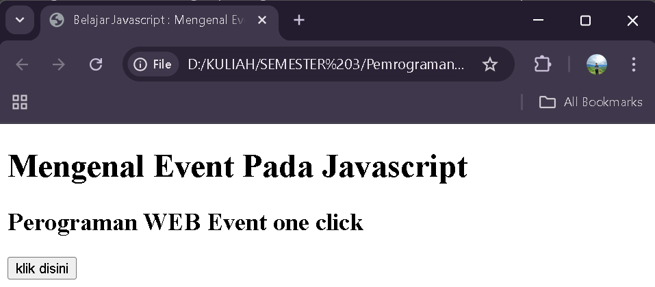
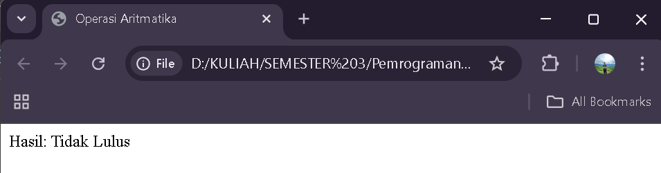

# PERTEMUAN 5 - `Dasar Java Script`

## 1. Javascript pada file HTML

### a. Menggunakan tag SCRIPT - `praktikum1a.html`

Output:


Analisis:

- Dalam tag `<head>` dan `<body>` pada file html, diletakkan tag `<script>` dengan atribut `language = "JavaScript"` menandakan bahwa script menggunakan bahasa pemrograman JavaScript
- Tag `<script>` dalam tag `<head>` berisi program `document.write("Program JavaSript Aku di kepala");` yang berfungsi mencetak teks "Program JavaSript Aku di kepala"
- Tag `<script>` dalam tag `<body>` berisi program `document.write("Program JavaSript Aku di body");` yang berfungsi mencetak teks "Program JavaSript Aku di body"

### b. Menggunakan File Eksternal - `praktikum1b.html`

Output:


Analisis:

- Dalam tag `<body>` file html dipanggil kode program dari luar file dengan kode `<script language="JavaScript" SRC="JS/fileEks.js"></script>`
- `language="JavaScript"` menandakan bahwa program menggunakan bahasa JavaScript
- `SRC="JS/fileEks.js"` artinya , program dipanggil dari file bernama <strong>fileEks.js</strong> dalam folder <strong>JS</strong>. Isi filenya adalah `document.write("Program JavaSript Aku di panggil dari luar");` yang berfungsi mencetak teks "Program JavaSript Aku di panggil dari luar"

### c. Event Tertentu - `praktikum1c.html`

Output:



Analisis:

- Pada elemen `<button>` diberikan atribut `onclick="tampilkan_nama()"` yang berfungsi memanggil fungsi `tampilkan_nama()` ketika tombol diklik
- Fungsi `tampilkan_nama()` menggunakan `document.getElementById("hasil").innerHTML` untuk menampilkan teks ke dalam elemen `<div>` dengan `id="hasil"`
- Hasil yang ditampilkan setelah tombol diklik adalah teks <strong>"Nama Saya Adalah Washiatul Akmal"</strong>

### d. Contoh Sederhan - `praktikum1d.html`

Output:


Analisis:

- Dalam file html pada tag `<body>`, terdapat tag `<script>` dengan atribut `language="JavaScript"` yang menandakan bahwa script menggunakan bahasa pemrograman JavaScript
- Dalam tag `<script>` berisi kode program `document.write("Selamat Belajar Angkatan 2024","<br>");` yang berfungsi menampilkan teks <strong>"Selamat Belajar Angkatan 2024"</strong>. `"<br>"` berfungsi membuat baris baru setelah teks. Kemudian di baris kedua terdapat kode `document.write("JavaScript Pemrograman WEB Teknik Komputer");` yang berfungsi menampilakan teks <strong>"JavaScript Pemrograman WEB Teknik Komputer"</strong>

---

## 2. Memasukkan Data

### Memasukkan Data - `praktikum2.html`

output:


Analisis:

- Tag `<script>` dengan atribut `language="JavaScript"` menandakan bahwa kode yang ditulis adalah program JavaScript
- Fungsi `prompt("Siapa nama Anda?")` digunakan untuk menampilkan kotak dialog input pada browser, lalu menyimpan hasil input ke variabel `nama`
- Perintah `document.write("Hai, " + nama)`; menampilkan hasil berupa teks <strong>"Hai, [nama]"</strong> pada halaman web, di mana <strong>[nama]</strong> adalah data yang dimasukkan oleh user
- Dengan demikian, jika user mengetik <strong>Akmal</strong>, maka hasil yang muncul di layar adalah: <strong>Hai, Akmal</strong>

---

## 3. Jendela Peringatan dan Konfirmasi

### a. Alert Box - `praktikum3a.html`

Output:


Analisis:

- Tag `<script>` dengan atribut `language="JavaScript"` menandakan bahwa kode yang ditulis adalah program JavaScript
- Perintah `window.alert("Apakah anda akan meninggalkan laman ini?")` berfungsi menampilkan kotak dialog peringatan <strong>(alert box)</strong> kepada pengguna
- Pesan <strong>"Apakah anda akan meninggalkan laman ini?"</strong> ditampilkan dalam kotak dialog
- Program akan berhenti sementara sampai user menekan tombol <strong>OK</strong> pada kotak dialog tersebut

### b. Konfirmasi - `praktikum3b.html`

Output:


Analisis:

- Tag `<script>` dengan atribut `language="JavaScript"` menandakan bahwa kode yang ditulis adalah program JavaScript
- Perintah `window.confirm("Apakah anda sudah yakin?")` akan menampilkan kotak dialog konfirmasi dengan dua tombol: <strong>OK</strong> dan <strong>Cancel</strong>
- Hasil dari `confirm()` akan disimpan dalam variabel `jawaban`: Jika user klik <strong>OK</strong> maka nilainya <strong>true</strong>. Tetapi, jika user klik <strong>Cancel</strong> maka nilainya <strong>false</strong>
- Perintah `document.write("Jawaban Anda: " + jawaban);` menampilkan hasil pilihan user ke halaman web, sehingga muncul teks:

  <strong>Jawaban Anda: true</strong> (jika klik OK)

  <strong>Jawaban Anda: false</strong> (jika klik Cancel)

---

## 4. Variabel

### a. Mendeklarasikan Variabel - `praktikum4a.html`

Output:


Analisis:

- Tag `<script>` dengan atribut `language="JavaScript"` menandakan bahwa kode yang ditulis adalah program JavaScript
- `var VariabelKu;` mendeklarasikan variabel bernama <strong>VariabelKu</strong> tanpa memberi nilai awal
- `var VariabelKu2 = 3;` mendeklarasikan variabel <strong>VariabelKu2</strong> dengan nilai awal <strong>3</strong>
- `VariabelKu = 1234;` memberikan nilai <strong>1234</strong> ke variabel <strong>VariabelKu</strong>
- `document.write(VariabelKu * VariabelKu2);` menampilkan hasil perkalian kedua variabel tersebut ke halaman web yaitu: <strong>3702</strong>

### b. Variabel Global - `praktikum4b.html`

Output:


Analisis:

- Tag `<script>` dengan atribut `language="JavaScript"` menandakan bahwa kode yang ditulis adalah program JavaScript
- `var a = 12;` mendeklarasikan variabel <strong>a</strong> dengan nilai awal <strong>12</strong>
- `var b = 4;` mendeklarasikan variabel <strong>b</strong> dengan nilai awal <strong>4</strong>
- function `Perkalian_Dengan2(b)` adalah fungsi dengan parameter <strong>b</strong> yang menghitung hasil perkalian `b * 2` yang hasilnya disimpan ke variabel global <strong>a</strong> dan nilai hasil perkalian dikembalikan dengan `return a;`
- `document.write("Dua kali dari ", b, " adalah ", Perkalian_Dengan2(b));` menampilkan teks dengan hasil perhitungan fungsi
- `document.write(", Nilai dari a adalah ", a);` menampilkan nilai terbaru dari variabel <strong>a</strong>
- Karena `b = 4`, maka: `Perkalian_Dengan2(b)` = `4 * 2 = 8`, sehingga <strong>a</strong> berubah nilainya menjadi <strong>8</strong>

### c. Variabel Lokal - `praktikum4c.html`

Output:


Analisis:

- Tag `<script>` dengan atribut `language="JavaScript"` menandakan bahwa kode yang ditulis adalah program JavaScript
- `var a = 12;` mendeklarasikan variabel global <strong>a</strong> dengan nilai awal <strong>12</strong>
- `var b = 4;` mendeklarasikan variabel <strong>b</strong> dengan nilai awal <strong>4</strong>
- Fungsi `Perkalian_Dengan2(b)` membuat variabel lokal <strong>a</strong> bernilai `b * 2` dan mengembalikannya sebagai hasil dengan `return a`
- `document.write("Dua kali dari ", b, " adalah ", Perkalian_Dengan2(b));` Menampilkan hasil fungsi yaitu `4 * 2 = 8`
- `document.write(", Nilai dari a adalah ", a);` Menampilkan nilai variabel <strong>a</strong> global, yang tetap 12 (tidak berubah oleh fungsi, karena di dalam fungsi dibuat variabel lokal baru)

---

## 5. Tipe Data

### Konversi Tipe Data - `praktikum5.html`

Output:


Kode:

```html
<script language="JavaScript">
  var a = parseInt("27");
  document.write("1. " + a + "<BR>");
  a = parseInt("27.5");
  document.write("2. " + a + "<BR>");
  var a = parseInt("27A");
  document.write("3. " + a + "<BR>");
  a = parseInt("A27.5");
  document.write("4. " + a + "<BR>");

  var b = parseFloat("27");
  document.write("5. " + b + "<BR>");
  b = parseFloat("27.5");
  document.write("6. " + b + "<BR>");
  var b = parseFloat("27A");
  document.write("7. " + b + "<BR>");
  b = parseFloat("A27.5");
  document.write("8. " + b + "<BR>");
</script>
```

Analisis:

- Tag `<script>` dengan atribut `language="JavaScript"` menandakan bahwa kode yang ditulis adalah program JavaScript
- `var a` dan `var b` mendeklarasikan variabel dengan nilai <strong>int</strong> dan <strong>float</strong> yang dikonversi dari <strong>string</strong>
- `"<BR>"` berfungsi membuat baris baru
- `parseInt("27")` menghasilkan <strong>27</strong> karena seluruh string adalah angka bulat
- `parseInt("27.5")` menghasilkan <strong>27</strong> karena desimal <strong>(.5)</strong> diabaikan
- `parseInt("27A")` menghasilkan <strong>27</strong> karena parsing berhenti saat menemukan huruf <strong>A</strong>
- `parseInt("A27.5")` menghasilkan <strong>NaN</strong> karena string tidak diawali angka
- `parseFloat("27")` menghasilkan <strong>27</strong> karena string hanya berisi angka bulat
- `parseFloat("27.5")` menghasilkan <strong>27.5</strong> karena mendukung angka desimal
- `parseFloat("27A")` menghasilkan <strong>27</strong> karena parsing berhenti saat menemukan huruf <strong>A</strong>
- `parseFloat("A27.5")` menghasilkan <strong>NaN</strong> karena string tidak diawali angka

---

## 6. Operator Aritmatika

### Aritmatika - `praktikum6.html`

Output:


Analisis:

- Tag `<script>` dengan atribut `language="JavaScript"` menandakan bahwa kode yang ditulis adalah program JavaScript
- `document.write("2 + 3 = " + (2 + 3));` menampilkan hasil penjumlahan <strong>2 + 3</strong>
- `document.write("20 - 3 = " + (20 - 3));` menampilkan hasil pengurangan <strong>20 - 3</strong>
- `document.write("20 * 3 = " + (20 * 3));` menampilkan hasil perkalian <strong>20 × 3</strong>
- `document.write("40 / 3 = " + (40 / 3));` menampilkan hasil pembagian <strong>40 ÷ 3</strong>
- Setiap `document.write("<BR>");` berfungsi membuat baris baru di tampilan HTML

---

## 7. Operator Logika dan Pembanding

### Logika dan Pembanding - `praktikum7.html`

Output:




Analisis:

- Tag `<script>` dengan atribut `language="JavaScript"` menandakan bahwa kode yang ditulis adalah program JavaScript
- `prompt("Nilai (0-100): ", 0)` digunakan untuk meminta input nilai dari pengguna dengan default <strong>0</strong>
- Variabel `hasil` menggunakan operator ternary sehingga jika `nilai >= 60` maka bernilai `"Lulus"`, sedangkan jika `kurang dari 60` maka bernilai `"Tidak Lulus"`
- `document.write("Hasil: " + hasil)` menampilkan hasil evaluasi ke halaman web

---

---

---

# TUGAS

## Tugas 1

### Konversi Tipe Data - `tugas1.html`

Script:

```html
<script language="JavaScript">
  var akmal = "27.5_elnino";

  var integer = parseInt(akmal);
  var float = parseFloat(akmal);
  var text = String(akmal);

  document.write("<pre>");
  document.write("Integer    : " + integer + "<br>");
  document.write("Float      : " + float + "<br>");
  document.write("String     : " + text + "<br>");
  document.write("</pre>");
</script>
```

Output:


Analisis:

- Variabel `akmal` menyimpan string <strong>"27.5_elnino"</strong>
- `parseInt(akmal)` mengubah string menjadi bilangan bulat hingga bertemu karakter bukan angka, sehingga menghasilkan <strong>27</strong>
- `parseFloat(akmal)` mengubah string menjadi bilangan pecahan (float) hingga bertemu karakter bukan angka, sehingga menghasilkan <strong>27.5</strong>
- `String(akmal)` mengonversi nilai kembali menjadi string, sehingga tetap menghasilkan <strong>"27.5_elnino"</strong>
- `document.write("<pre>")` digunakan agar output ditampilkan dengan format rata dan rapi (preserve spacing).

---

## Tugas 2

### Tipe Data dalam Array - `tugas2.html`

Script:

```html
<script language="JavaScript">
  var data = [27, "27_elnino", true];
  document.write("<h3>ISI ARRAY</h3>");
  for (i = 0; i < data.length; i++) {
    document.write(
      "index ke-" + i + "(" + typeof data[i] + ")  : " + data[i] + "<br>"
    );
  }
</script>
```

Output:


Analisis:

- Variabel `data` didefinisikan sebagai array berisi tiga elemen: <strong>angka</strong> `27`, <strong>string</strong> `"27_elnino"`, dan <strong>boolean</strong> `true`
- `document.write("<h3>ISI ARRAY</h3>");` menampilkan <strong>judul</strong> pada halaman
- Perulangan `for` digunakan untuk mengakses setiap <strong>elemen array</strong> dari <strong>indeks</strong> `0` sampai `data.length - 1`
- `typeof data[i]` menampilkan tipe data dari setiap elemen array
- `document.write(...)` menampilkan informasi berupa <strong>indeks</strong>, <strong>tipe data</strong>, dan <strong>nilai elemen array</strong> ke halaman web

---

## Tugas 3

### Kalkulator Sederhana - `tugas3.html`

Script:

```html
<script language="JavaScript">
  function hitung() {
    var a = parseFloat(document.getElementById("angka1").value);
    var b = parseFloat(document.getElementById("angka2").value);
    var operator = document.getElementById("operator").value;
    var hasil;

    if (operator == "+") hasil = a + b;
    else if (operator == "-") hasil = a - b;
    else if (operator == "*") hasil = a * b;
    else if (operator == "/") hasil = a / b;

    document.getElementById("hasil").innerText = hasil;
  }
</script>
```

Output:


Analisis:

- Fungsi `hitung()` dibuat untuk melakukan <strong>operasi aritmatika</strong> berdasarkan input pengguna
- `document.getElementById("angka1").value` dan `document.getElementById("angka2").value` mengambil nilai dari input <strong>teks</strong>, lalu diubah ke <strong>bilangan</strong> dengan `parseFloat()`
- Variabel `operator` menyimpan simbol operasi <strong>(+, -, \*, /)</strong> dari elemen input
- Struktur `if ... else if` digunakan untuk menentukan <strong>operasi aritmatika</strong> yang sesuai
- Variabel `hasil` berisi hasil perhitungan sesuai <strong>operator</strong> yang dipilih
- `document.getElementById("hasil").innerText = hasil;` menampilkan hasil perhitungan ke elemen HTML dengan id <strong>hasil</strong>

---

## Tugas 4

### Perhitungan Bangun Ruang - `tugas4.html`

Script:

```html
<script language="JavaScript">
  function hitungKubus() {
    var s = parseFloat(document.getElementById("sisi").value);
    var volume = s * s * s;
    document.getElementById("vkubus").innerText = volume;
  }

  function hitungBalok() {
    var p = parseFloat(document.getElementById("panjang").value);
    var l = parseFloat(document.getElementById("lebar").value);
    var t = parseFloat(document.getElementById("tinggi").value);
    var volume = p * l * t;
    document.getElementById("vbalok").innerText = volume;
  }

  function hitungTabung() {
    var r = parseFloat(document.getElementById("jari").value);
    var t = parseFloat(document.getElementById("ttabung").value);
    var volume = 3.14 * r * r * t;
    document.getElementById("vtabung").innerText = volume;
  }
</script>
```

Output:


Analisis:

- Fungsi `hitungKubus()` menghitung <strong>volume kubus</strong> dengan rumus `s * s * s`, di mana <strong>s</strong> diambil dari input dengan id <strong>sisi</strong>
- Fungsi `hitungBalok()` menghitung <strong>volume balok</strong> dengan rumus `p * l * t`, di mana <strong>p</strong>, <strong>l</strong>, dan <strong>t</strong> diambil dari input dengan id <strong>panjang</strong>, <strong>lebar</strong>, dan <strong>tinggi</strong>
- Fungsi `hitungTabung()` menghitung <strong>volume tabung</strong> dengan rumus `3.14 * r * r * t`, di mana <strong>r</strong> diambil dari input dengan id <strong>jari</strong> dan <strong>t</strong> dari id <strong>ttabung</strong>
- `parseFloat()` digunakan untuk mengonversi nilai input <strong>(string)</strong> menjadi bilangan <strong>pecahan</strong>
- `document.getElementById("...").innerText = volume;` menampilkan hasil perhitungan <strong>volume</strong> ke elemen HTML yang sesuai

---
